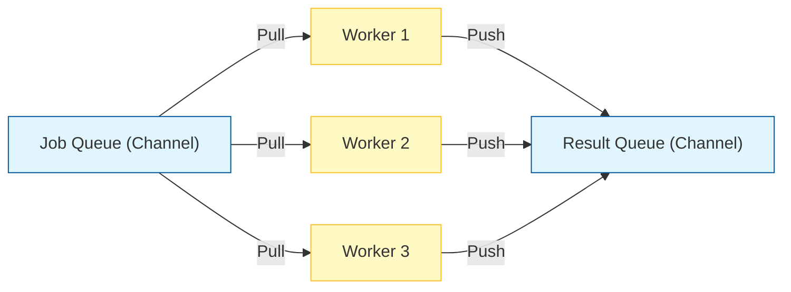

## Overview

Concurrency is Go's superpower. Unlike OS threads which are heavy (1MB+ stack), Go uses **Goroutines** (2KB stack). A single Go program can easily run tens of thousands of concurrent tasks.

This chapter explores goroutines, channels, and demonstrates the **Worker Pool** pattern — a production-ready approach to managing concurrent tasks.

## Core Concurrency Components

<Steps>

### Goroutine (`go func()`)
A lightweight thread of execution managed by the Go runtime.

### Channel (`make(chan T)`)
A pipe that connects concurrent goroutines. You send values into one end and receive from the other.

### WaitGroup (`sync.WaitGroup`)
A counter to wait for a collection of goroutines to finish.

</Steps>

## Goroutines: Lightweight Concurrency

### Basic Goroutine Example

```go concurrency/task1/main.go
func say(s string) {
	for i := 0; i < 5; i++ {
		time.Sleep(100*time.Millisecond)
		fmt.Println(s)
	}
}

func main() {
   go say("world")  // Runs concurrently
   say("hello")     // Runs in main goroutine
}
```

<Info>
The `go` keyword launches a new goroutine. The function executes concurrently with the rest of the program.
</Info>

### Multiple Goroutines

```go concurrency/task3/main.go
func printNumbers() {
	for i := 0; i < 5; i++ {
		time.Sleep(100*time.Millisecond)
		 fmt.Println(i)
	}
}

func printLetters(){
	for ch:='a';ch<='e';ch++{
		time.Sleep(100*time.Millisecond)
		 fmt.Println(string(ch))
	}
}

func main() {
   go printNumbers()
   go printLetters()
   time.Sleep(1* time.Second)  // Wait for goroutines to finish
}
```

<Warning>
**Problem**: Using `time.Sleep()` to wait for goroutines is unreliable. What if they take longer than expected? This is where channels and WaitGroups come in.
</Warning>

## Channels: Communication Between Goroutines

Channels allow goroutines to communicate safely without explicit locks.

### Creating Channels

```go
// Unbuffered channel (blocks until receiver is ready)
ch := make(chan int)

// Buffered channel (can hold values without blocking)
ch := make(chan int, 100)
```

### Channel Operations

<CodeGroup>

```go Sending to Channel
ch <- value  // Send value to channel
```

```go Receiving from Channel
value := <-ch  // Receive value from channel
```

```go Closing a Channel
close(ch)  // Signal no more values will be sent
```

</CodeGroup>

### Synchronizing with Channels

```go concurrency/task4/main.go
func numbers(ch chan bool) {
	for i := 0; i < 5; i++ {
		time.Sleep(100*time.Millisecond)
		fmt.Println(i)
	}
	ch<- true  // Send signal: "I'm done"
}

func character(ch chan bool){
	for i:='a';i<='e';i++{
		time.Sleep(100*time.Millisecond)
		fmt.Println(string(i))
	}
	ch<-true
}

func main() {
     ch:=make(chan bool, 1)
	 go numbers(ch)
	 go character(ch)
	 <-ch  // Wait for first completion
	 <-ch  // Wait for second completion
}
```

<Note>
Channels provide a way to synchronize goroutines without explicit locks. The `<-ch` operation blocks until a value is available.
</Note>

## Worker Pool Pattern

Instead of spawning a new goroutine for every single job (which can crash a system under load), we start a **fixed number of workers** that pick jobs from a queue.

### Why Worker Pools?

- **Resource Control**: Limit concurrent operations (e.g., max 10 concurrent HTTP requests)
- **Efficiency**: Reuse goroutines instead of creating/destroying them
- **Backpressure**: Queue jobs when all workers are busy

### Architecture: Fan-Out / Fan-In



### Complete Worker Pool Implementation

<Steps>

### Step 1: Define the Worker Function

```go concurrency/main.go
func worker(wg *sync.WaitGroup, resultChan chan string, jobsChan chan string) {
	defer wg.Done() // Ensure Done is called when function exits

	for url := range jobsChan {
		// Simulate network delay
		time.Sleep(time.Millisecond * 50)
		fmt.Println("Fetching URL:", url)
		resultChan <- "Fetched " + url
	}
}
```

<Info>
The `for url := range jobsChan` loop automatically stops when the channel is closed.
</Info>

### Step 2: Set Up Channels and WaitGroup

```go concurrency/main.go
jobs := []string{
	"http://example.com/image1.jpg",
	"http://example.com/image2.jpg",
	"http://example.com/image3.jpg",
	"http://example.com/image4.jpg",
	"http://example.com/image5.jpg",
}

var wg sync.WaitGroup
totalWorkers := 5
resultChan := make(chan string, len(jobs))
jobsChan := make(chan string, len(jobs))
```

### Step 3: Start Workers

```go concurrency/main.go
for i := 0; i < totalWorkers; i++ {
	wg.Add(1)
	go worker(&wg, resultChan, jobsChan)
}
```

### Step 4: Send Jobs and Close Job Channel

```go concurrency/main.go
for _, job := range jobs {
	jobsChan <- job
}
close(jobsChan)  // Signal: no more jobs coming
```

### Step 5: Wait and Close Result Channel

```go concurrency/main.go
go func() {
	wg.Wait()           // Wait for all workers to finish
	close(resultChan)   // Close result channel
}()
```

<Warning>
**Critical**: We wait in a separate goroutine to avoid deadlock. If we waited in the main thread before reading results, the program could deadlock if the result channel fills up.
</Warning>

### Step 6: Collect Results

```go concurrency/main.go
for result := range resultChan {
	fmt.Println("Result received:", result)
}

fmt.Println("Total time taken:", time.Since(start))
```

</Steps>

### Full Worker Pool Code

```go concurrency/main.go
package main

import (
	"fmt"
	"sync"
	"time"
)

func worker(wg *sync.WaitGroup, resultChan chan string, jobsChan chan string) {
	defer wg.Done()

	for url := range jobsChan {
		time.Sleep(time.Millisecond * 50)
		fmt.Println("Fetching URL:", url)
		resultChan <- "Fetched " + url
	}
}

func main() {
	jobs := []string{
		"http://example.com/image1.jpg",
		"http://example.com/image2.jpg",
		"http://example.com/image3.jpg",
		"http://example.com/image4.jpg",
		"http://example.com/image5.jpg",
	}

	var wg sync.WaitGroup
	totalWorkers := 5
	resultChan := make(chan string, len(jobs))
	jobsChan := make(chan string, len(jobs))

	start := time.Now()

	// Start workers
	for i := 0; i < totalWorkers; i++ {
		wg.Add(1)
		go worker(&wg, resultChan, jobsChan)
	}

	// Send jobs to workers
	for _, job := range jobs {
		jobsChan <- job
	}
	close(jobsChan)

	// Wait for all workers to finish
	go func() {
		wg.Wait()
		close(resultChan)
	}()

	// Collect results
	for result := range resultChan {
		fmt.Println("Result received:", result)
	}

	fmt.Println("Total time taken:", time.Since(start))
}
```

## Key Concepts Explained

### Buffered vs Unbuffered Channels

| Type | Declaration | Behavior |
|------|-------------|----------|
| **Unbuffered** | `make(chan int)` | Sender blocks until receiver is ready |
| **Buffered** | `make(chan int, 100)` | Sender only blocks when buffer is full |

### WaitGroup Pattern

```go
var wg sync.WaitGroup

wg.Add(1)        // Increment counter
go func() {
    defer wg.Done()  // Decrement when done
    // ... work ...
}()

wg.Wait()        // Block until counter reaches 0
```

### Channel Closing Rules

<Warning>
- Only the **sender** should close a channel
- Closing an already-closed channel causes panic
- Sending to a closed channel causes panic
- Receiving from a closed channel returns the zero value
</Warning>

## Common Patterns

### Pattern 1: Fan-Out (Distribute Work)

```go
for i := 0; i < numWorkers; i++ {
    go worker(jobsChan, resultsChan)
}
```

### Pattern 2: Fan-In (Collect Results)

```go
for result := range resultsChan {
    // Process result
}
```

### Pattern 3: Pipeline

```go
stage1 := generate(input)
stage2 := process(stage1)
stage3 := output(stage2)
```

## Performance Benefits

<Info>
**Example**: Fetching 5 URLs sequentially would take 250ms (5 × 50ms). With 5 workers running concurrently, it takes just ~50ms — a **5x speedup**!
</Info>

## Running the Examples

```bash
cd concurrency
go run main.go
```

You'll see workers processing jobs concurrently and the total execution time.

## Best Practices

<Steps>

### Always close channels when done sending
This prevents goroutine leaks and allows range loops to exit cleanly.

### Use buffered channels for known workloads
Buffer size = number of jobs prevents unnecessary blocking.

### Use WaitGroups for synchronization
Avoid `time.Sleep()` — it's unreliable and wastes resources.

### Handle panics in goroutines
A panic in a goroutine crashes the entire program. Use `defer recover()` for critical workers.

</Steps>

## Next Steps

- Explore [context for cancellation](https://pkg.go.dev/context)
- Learn about [select statements for multiple channels](https://go.dev/tour/concurrency/5)
- Understand [race conditions and the race detector](https://go.dev/doc/articles/race_detector)