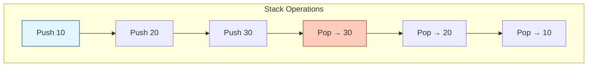
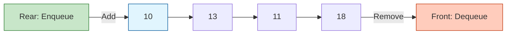
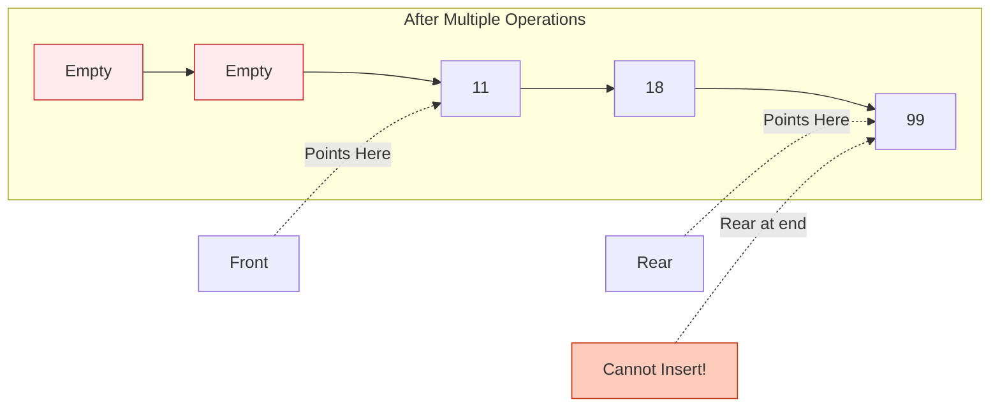

## Overview

Understanding how to build basic data structures from scratch is crucial for understanding how memory works and how algorithms operate. This chapter implements two fundamental data structures in Go:

1. **Stack** (Last-In-First-Out)
2. **Queue** (First-In-First-Out)

Both use Go slices as the underlying storage mechanism, demonstrating how high-level abstractions can be built on top of Go's built-in types.

## Stack (LIFO)

A Stack is a Last-In-First-Out (LIFO) data structure. Think of it like a stack of plates:
- You add plates to the top (**Push**)
- You remove plates from the top (**Pop**)
- You can only access the top plate

### Visual Representation



### Stack Implementation

```go stack/main.go
type Stack struct{
	data[]int
	size int
	top int
}

func NewStack(size int) *Stack{
	return &Stack {
		data: make([]int,size),
		top:-1,
		size:size,
	}
}
```

<Note>
The `top` field tracks the index of the top element. When `top == -1`, the stack is empty.
</Note>

### Push Operation

Adds an element to the top of the stack.

```go stack/main.go
func(s *Stack)Push( x int)bool{
	if s.top==s.size-1{
		return false  // Stack is full
	}
	s.top++
	s.data[s.top]=x
	return true
}
```

<Steps>

### Check if stack is full
`top == size-1` means no space left.

### Increment top pointer
Move to the next available position.

### Store the value
Place the element at the new top position.

</Steps>

### Pop Operation

Removes and returns the top element.

```go stack/main.go
func( s *Stack) Pop()(int,bool){
	if s.top==-1{
		return 0,false  // Stack is empty
	}
	x:=s.data[s.top]
	s.top--
	return x,true
}
```

<Info>
**Why return `bool`?** Go doesn't have exceptions. Returning a boolean allows the caller to check if the operation succeeded.
</Info>

### Stack Usage Example

```go stack/main.go
func main(){
     s:=NewStack(10)
     
     s.Push(5)
     s.Push(10)
     s.Push(15)
     
     value, ok := s.Pop()  // Returns 15, true
     if ok {
         fmt.Println("Popped:", value)
     }
}
```

### Stack Operations Complexity

| Operation | Time Complexity | Space Complexity |
|-----------|----------------|------------------|
| Push | O(1) | O(1) |
| Pop | O(1) | O(1) |
| Peek/Top | O(1) | O(1) |
| IsEmpty | O(1) | O(1) |

## Queue (FIFO)

A Queue is a First-In-First-Out (FIFO) data structure. Think of it like a line at a ticket counter:
- People join at the **rear** (**Enqueue**)
- People leave from the **front** (**Dequeue**)
- First person in line is served first

### Visual Representation



### Queue Implementation

```go queue/main.go
type Queue struct {
	front int
	rear  int
	size  int
	data  []int
}

func NewQueue(size int) *Queue {
	return &Queue{
		data:  make([]int, size),
		size:  size,
		front: -1,
		rear:  -1,
	}
}
```

<Note>
Both `front` and `rear` start at -1 to indicate an empty queue.
</Note>

### Enqueue Operation

Adds an element to the rear of the queue.

```go queue/main.go
func (q *Queue) Enqueue(x int) bool {
	if q.rear == q.size-1 {
		return false // queue full
	}

	if q.front == -1 {
		q.front = 0
	}

	q.rear++
	q.data[q.rear] = x
	return true
}
```

<Steps>

### Check if queue is full
`rear == size-1` means no more space.

### Initialize front on first insert
When the queue is empty, set `front = 0`.

### Increment rear and insert
Move rear pointer and store the value.

</Steps>

### Dequeue Operation

Removes and returns the front element.

```go queue/main.go
func (q *Queue) Dequeue() (int, bool) {
	if q.front == -1 {
		return 0, false // queue empty
	}

	x := q.data[q.front]

	if q.front == q.rear {
		q.front = -1
		q.rear = -1
	} else {
		q.front++
	}

	return x, true
}
```

<Warning>
**Linear Queue Limitation**: When `rear` reaches the end, the queue cannot accept new elements even if space exists at the front! This implementation is a "Linear Queue".
</Warning>

### Queue Usage Example

```go queue/main.go
func main() {
	q := NewQueue(5)

	q.Enqueue(10)
	q.Enqueue(13)
	q.Enqueue(11)
	q.Enqueue(18)

	fmt.Println(q.Dequeue()) // 10, true

	q.Enqueue(99) // May fail if rear is at end!

	fmt.Println(q.data)
}
```

### Queue Operations Complexity

| Operation | Time Complexity | Space Complexity |
|-----------|----------------|------------------|
| Enqueue | O(1) | O(1) |
| Dequeue | O(1) | O(1) |
| Peek/Front | O(1) | O(1) |
| IsEmpty | O(1) | O(1) |

## Linear Queue vs Circular Queue

### The Problem with Linear Queues



Even though positions 0 and 1 are empty, we cannot insert because `rear` has reached the end!

### Solution: Circular Queue

A **Circular Queue** wraps around using modulo arithmetic:

```go
func (q *Queue) Enqueue(x int) bool {
    if (q.rear + 1) % q.size == q.front {
        return false // Actually full
    }
    
    if q.front == -1 {
        q.front = 0
    }
    
    q.rear = (q.rear + 1) % q.size
    q.data[q.rear] = x
    return true
}
```

<Info>
Using `% q.size` makes the queue "wrap around" to position 0 when it reaches the end.
</Info>

## Stack vs Queue Comparison

| Feature | Stack | Queue |
|---------|-------|-------|
| **Order** | LIFO (Last-In-First-Out) | FIFO (First-In-First-Out) |
| **Insertion** | Push (top) | Enqueue (rear) |
| **Removal** | Pop (top) | Dequeue (front) |
| **Access** | Top only | Front only |
| **Use Cases** | Function calls, undo/redo, expression evaluation | Task scheduling, BFS, print queue |

## Real-World Use Cases

### Stack Applications

<Steps>

### Function Call Stack
Go's runtime uses a stack to track function calls.

### Undo/Redo
Text editors push operations onto a stack.

### Expression Evaluation
Parsing mathematical expressions (postfix notation).

### Browser History
Back button uses a stack of visited pages.

</Steps>

### Queue Applications

<Steps>

### Task Scheduling
Operating systems use queues for process scheduling.

### Breadth-First Search
BFS algorithm uses a queue to explore nodes.

### Print Queue
Documents wait in a FIFO queue.

### Message Queues
Asynchronous communication systems (RabbitMQ, Kafka).

</Steps>

## Memory Representation

### Stack Memory Layout

```
Index:  0    1    2    3    4
Data:  [10] [20] [30] [ ] [ ]
                   ↑
                  top=2
```

### Queue Memory Layout

```
Index:     0    1    2    3    4
Data:     [ ] [ ] [11] [18] [99]
                   ↑         ↑
                front=2    rear=4
```

## Running the Examples

<CodeGroup>

```bash Stack Example
cd stack
go run main.go
```

```bash Queue Example
cd queue
go run main.go
```

</CodeGroup>

## Best Practices

<Warning>
**Always check return values**: Both `Pop()` and `Dequeue()` return a boolean to indicate success. Always check before using the returned value.
</Warning>

```go
value, ok := stack.Pop()
if !ok {
    fmt.Println("Stack is empty!")
    return
}
fmt.Println("Popped:", value)
```

## Improvements and Extensions

<Steps>

### Add Peek/Top operations
View the top/front element without removing it.

### Implement dynamic resizing
Automatically grow the underlying slice when full.

### Make them generic
Use Go generics to support any type, not just `int`.

### Add thread safety
Use `sync.Mutex` for concurrent access.

</Steps>

### Generic Stack Example

```go
type Stack[T any] struct {
    data []T
    top  int
}

func (s *Stack[T]) Push(x T) {
    s.data = append(s.data, x)
    s.top++
}
```

## Next Steps

- Implement a **Circular Queue** to solve the linear queue limitation
- Build a **Priority Queue** using a heap
- Explore Go's built-in **container/list** and **container/heap** packages
- Study more complex structures like **Trees** and **Graphs**