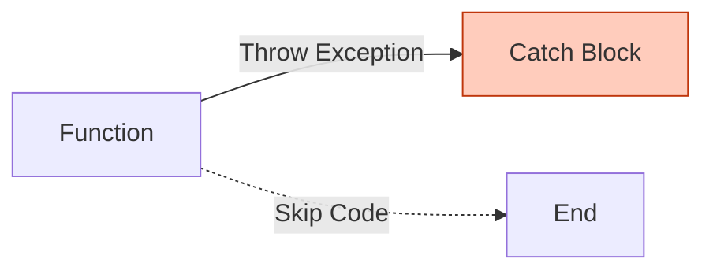
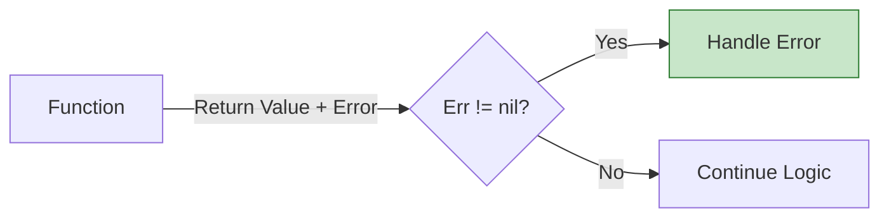

## Overview

In many languages (Java, Python, JavaScript), errors are "exceptions" — they crash the program unless you catch them. In Go, **Errors are Values**. They are just like `int` or `string`. You don't "throw" them; you pass them around.

This philosophy forces you to handle failure cases explicitly where they happen, rather than letting them bubble up and crash your app unexpectedly.

## Core Philosophy: Errors as Values

Go treats errors as normal return values. Every function that can fail returns two things:

1. The **result** (if successful)
2. An **error** (if something went wrong)

```go
result, err := someFunction()
if err != nil {
    // Handle the error
}
// Use result
```

<Note>
The `error` type is simply an interface with a single method:
```go
type error interface {
    Error() string
}
```
Anything that implements this interface is an error.
</Note>

## Flow Comparison

<CodeGroup>





</CodeGroup>

## Sentinel Errors

Think of sentinel errors as "Error Constants" — pre-defined error values that you check for specific conditions.

### Defining Sentinel Errors

```go errorhandling/main.go
var ErrNotFound = errors.New("item not found")
```

### Using Sentinel Errors

```go errorhandling/main.go
func findItem(id int) (string, error) {
	if id == 42 {
		return "Everything", nil
	}
	// Return the sentinel error
	return "", ErrNotFound
}
```

### Checking for Sentinel Errors with `errors.Is`

<Warning>
Always use `errors.Is()` instead of `==` for error comparison. This handles wrapped errors correctly.
</Warning>

```go errorhandling/main.go
item, err := findItem(100)
if err != nil {
	// Use errors.Is to check for specific sentinel errors
	if errors.Is(err, ErrNotFound) {
		fmt.Println("Search failed: The item does not exist.")
	} else {
		fmt.Println("Search failed: Unknown error.")
	}
} else {
	fmt.Println("Found:", item)
}
```

<Info>
**Analogy**: Sentinel errors are like checking a specific HTTP status code (404, 500, etc.).
</Info>

## Custom Error Types

Sometimes a simple string isn't enough. You need context: "Which URL failed?", "How many retries were attempted?".

Custom error types allow you to attach structured data to errors.

### Defining a Custom Error Type

```go errorhandling/main.go
type ConnectionError struct {
	URL      string
	Attempts int
}

func (e *ConnectionError) Error() string {
	return fmt.Sprintf("failed to connect to %s after %d attempts", e.URL, e.Attempts)
}
```

<Steps>

### Step 1: Define the struct
Create a struct that holds the additional context you need.

### Step 2: Implement the `Error()` method
This makes your struct satisfy the `error` interface.

### Step 3: Return the custom error
Return a pointer to your error struct when the operation fails.

</Steps>

### Returning Custom Errors

```go errorhandling/main.go
func connectToService(url string) error {
	// Simulate a failure
	return &ConnectionError{URL: url, Attempts: 3}
}
```

### Extracting Data with `errors.As`

Use `errors.As` to "unwrap" the error and access the fields inside the struct.

```go errorhandling/main.go
err = connectToService("http://example.com")
if err != nil {
	var connErr *ConnectionError
	if errors.As(err, &connErr) {
		fmt.Printf("Connection Error Details -> URL: %s | Retried %d times\n", 
			connErr.URL, connErr.Attempts)
	} else {
		fmt.Println("Generic error:", err)
	}
}
```

## Basic Error Handling Pattern

Here's a complete example showing the fundamental pattern:

```go errorhandling/task1/main.go
func getAge(m map[string]int, name string) (int, error) {
	if m == nil {
		return 0, errors.New("map is nil")
	}

	age, ok := m[name]
	if !ok {
		return 0, errors.New("name not found")
	}

	return age, nil
}

func main() {
	ages := map[string]int{
		"Alice": 25,
		"Bob":   30,
	}

	age, err := getAge(ages, "Alice")
	if err != nil {
		fmt.Println("error:", err)
		return
	}

	fmt.Println("age:", age)
}
```

## errors.Is vs errors.As

<CodeGroup>

```go errors.Is - For Sentinel Errors
// Use errors.Is to check if an error matches a specific value
if errors.Is(err, ErrNotFound) {
    // This specific error occurred
}
```

```go errors.As - For Custom Error Types
// Use errors.As to extract data from a custom error type
var connErr *ConnectionError
if errors.As(err, &connErr) {
    // Now you can access connErr.URL and connErr.Attempts
    fmt.Println(connErr.URL)
}
```

</CodeGroup>

| Function | Purpose | When to Use |
|----------|---------|-------------|
| `errors.Is` | Check if error matches a specific sentinel error | Comparing against pre-defined error constants |
| `errors.As` | Extract and type-assert custom error structs | When you need to access fields in a custom error type |

## Key Takeaways

<Steps>

### Errors are not exceptions
They're normal return values that must be explicitly checked.

### Use sentinel errors for simple cases
Define error constants with `errors.New()` and check with `errors.Is()`.

### Use custom error types for complex cases
Create structs that implement the `error` interface and extract with `errors.As()`.

### Always check errors immediately
Handle errors at the point where they occur, not later.

</Steps>

<Warning>
**The Cost of Ignoring Errors**: If you don't check `err != nil`, Go won't stop you, but your program will behave unpredictably when failures occur. Silent failures are debugging nightmares.
</Warning>

## Running the Examples

```bash
cd errorhandling
go run main.go
```

You'll see both sentinel error checking and custom error extraction in action.

## Next Steps

- Learn about [error wrapping with `fmt.Errorf`](https://pkg.go.dev/fmt#Errorf)
- Explore the [errors package documentation](https://pkg.go.dev/errors)
- Understand [when to use panic vs error returns](https://go.dev/blog/defer-panic-and-recover)