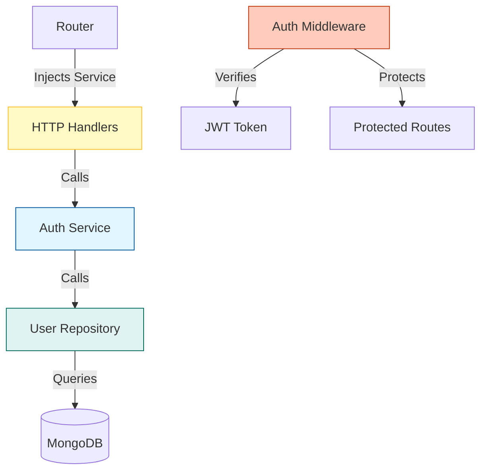

## Overview

**MiniAuth** demonstrates building a complete authentication system using industry-standard practices. This project implements JWT (JSON Web Tokens) for stateless authentication, bcrypt for secure password hashing, and middleware for protecting routes.

<Note>
This is part of **Chapter 10: Advanced Web** and showcases clean architecture with separated concerns (handlers, services, repositories).
</Note>

## What You'll Build

A full authentication system with:
- User signup and login
- Password hashing with bcrypt
- JWT token generation and verification
- Authentication middleware
- Protected routes (dashboard)
- Clean architecture with dependency injection

## Architecture Overview

The application follows a layered architecture pattern:



### Layer Responsibilities

| Layer | Responsibility | Example |
| :--- | :--- | :--- |
| **Handlers** | HTTP request/response | Extract form data, set cookies |
| **Service** | Business logic | Validate credentials, generate tokens |
| **Repository** | Data access | Query MongoDB, create users |
| **Middleware** | Cross-cutting concerns | Check JWT, redirect unauthorized users |

## Project Structure

```text
miniauth/
├── cmd/
│   └── server/
│       └── main.go          # Entry point with graceful shutdown
├── internal/
│   ├── app/
│   │   └── app.go          # Server initialization
│   ├── auth/
│   │   ├── service.go      # Business logic (signup, login)
│   │   ├── jwt.go          # Token generation/verification
│   │   └── password.go     # Password hashing
│   ├── http/
│   │   ├── routes.go       # Route definitions
│   │   ├── handlers.go     # HTTP handlers
│   │   └── middleware.go   # Auth middleware
│   ├── repository/
│   │   └── user_repository.go  # Database operations
│   ├── model/
│   │   └── user.go        # User data model
│   └── db/
│       └── mongo.go       # MongoDB connection
└── go.mod
```

## Core Components

### 1. Password Security with bcrypt

Never store passwords in plain text. Use bcrypt for secure hashing:

```go internal/auth/password.go
package auth

import "golang.org/x/crypto/bcrypt"

// HashPassword creates a bcrypt hash of the password
func HashPassword(password string) (string, error) {
    hash, err := bcrypt.GenerateFromPassword([]byte(password), 14)
    return string(hash), err
}

// CheckPassword verifies a password against its hash
func CheckPassword(hash, password string) error {
    return bcrypt.CompareHashAndPassword([]byte(hash), []byte(password))
}
```

<Warning>
**Cost Factor**: The `14` in `GenerateFromPassword` is the cost factor. Higher values are more secure but slower. 14 is a good balance for 2024.
</Warning>

#### Why bcrypt?

- **Slow by design**: Makes brute-force attacks impractical
- **Automatic salting**: Each hash is unique even for identical passwords
- **Future-proof**: Cost can be increased as computers get faster

### 2. JWT Token Management

JWTs enable stateless authentication - the server doesn't need to store session data.

```go internal/auth/jwt.go
package auth

import (
    "time"
    "github.com/golang-jwt/jwt/v5"
)

var secret = []byte("super_secret_key")

// GenerateToken creates a JWT token for the user
func GenerateToken(email string) (string, error) {
    claims := jwt.MapClaims{
        "email": email,
        "exp":   time.Now().Add(time.Hour).Unix(),
    }
    
    token := jwt.NewWithClaims(jwt.SigningMethodHS256, claims)
    return token.SignedString(secret)
}

// VerifyToken validates a JWT token
func VerifyToken(tokenStr string) error {
    _, err := jwt.Parse(tokenStr, func(t *jwt.Token) (interface{}, error) {
        return secret, nil
    })
    return err
}
```

<Note>
In production, load the secret from environment variables or a secrets manager, never hardcode it.
</Note>

#### JWT Structure

A JWT has three parts separated by dots:

```
header.payload.signature
```

**Claims in this implementation**:
- `email`: User identifier
- `exp`: Expiration timestamp (1 hour from creation)

### 3. Service Layer (Business Logic)

The service layer implements business rules and depends on interfaces, not concrete types:

```go internal/auth/service.go
package auth

import (
    "context"
    "errors"
    "github.com/priyanshu-samal/miniauth/internal/model"
)

// UserStore defines the interface for user data access
type UserStore interface {
    FindByEmail(context.Context, string) (*model.User, error)
    Create(context.Context, *model.User) error
}

type Service struct {
    users UserStore
}

func NewService(users UserStore) *Service {
    return &Service{users: users}
}

// Signup creates a new user account
func (s *Service) Signup(ctx context.Context, email, password string) error {
    // Check if user already exists
    _, err := s.users.FindByEmail(ctx, email)
    if err == nil {
        return errors.New("user already exists")
    }
    
    // Hash the password
    hash, err := HashPassword(password)
    if err != nil {
        return err
    }
    
    // Create user
    user := &model.User{
        Email:    email,
        Password: hash,
    }
    
    return s.users.Create(ctx, user)
}

// Login authenticates a user and returns a JWT token
func (s *Service) Login(ctx context.Context, email, password string) (string, error) {
    // Find user
    user, err := s.users.FindByEmail(ctx, email)
    if err != nil {
        return "", errors.New("invalid credentials")
    }
    
    // Verify password
    if err := CheckPassword(user.Password, password); err != nil {
        return "", errors.New("invalid credentials")
    }
    
    // Generate JWT token
    return GenerateToken(email)
}
```

<Steps>
  <Step title="Interface-Based Design">
    The service depends on `UserStore` interface, not a concrete MongoDB implementation. This enables:
    - Easy testing with mock repositories
    - Database swapping without changing business logic
    - Clean dependency injection
  </Step>
  
  <Step title="Security Best Practice">
    Never reveal whether the email or password was wrong - always return "invalid credentials" to prevent user enumeration attacks.
  </Step>
</Steps>

### 4. HTTP Handlers

Handlers bridge HTTP requests to service calls:

```go internal/http/handlers.go
package http

import (
    "net/http"
    "github.com/priyanshu-samal/miniauth/internal/auth"
)

// SignupHandler processes user registration
func SignupHandler(service *auth.Service) http.HandlerFunc {
    return func(w http.ResponseWriter, r *http.Request) {
        if r.Method != http.MethodPost {
            http.Error(w, "method not allowed", http.StatusMethodNotAllowed)
            return
        }
        
        email := r.FormValue("email")
        password := r.FormValue("password")
        
        if err := service.Signup(r.Context(), email, password); err != nil {
            http.Error(w, err.Error(), http.StatusBadRequest)
            return
        }
        
        w.Write([]byte("signup success"))
    }
}

// LoginHandler authenticates user and sets JWT cookie
func LoginHandler(service *auth.Service) http.HandlerFunc {
    return func(w http.ResponseWriter, r *http.Request) {
        if r.Method != http.MethodPost {
            http.Error(w, "method not allowed", http.StatusMethodNotAllowed)
            return
        }
        
        email := r.FormValue("email")
        password := r.FormValue("password")
        
        token, err := service.Login(r.Context(), email, password)
        if err != nil {
            http.Error(w, err.Error(), http.StatusUnauthorized)
            return
        }
        
        // Set JWT as HTTP-only cookie
        http.SetCookie(w, &http.Cookie{
            Name:  "token",
            Value: token,
            Path:  "/",
        })
        
        http.Redirect(w, r, "/dashboard", http.StatusFound)
    }
}

func LoginPage(w http.ResponseWriter, r *http.Request) {
    http.ServeFile(w, r, "web/login.html")
}

func SignupPage(w http.ResponseWriter, r *http.Request) {
    http.ServeFile(w, r, "web/signup.html")
}

func DashboardPage() http.Handler {
    return http.HandlerFunc(func(w http.ResponseWriter, r *http.Request) {
        http.ServeFile(w, r, "web/dashboard.html")
    })
}
```

#### Cookie Security

In production, enhance cookie security:

```go
http.SetCookie(w, &http.Cookie{
    Name:     "token",
    Value:    token,
    Path:     "/",
    HttpOnly: true,  // Prevents JavaScript access
    Secure:   true,  // HTTPS only
    SameSite: http.SameSiteStrictMode,
})
```

### 5. Authentication Middleware

Middleware intercepts requests to protected routes:

```go internal/http/middleware.go
package http

import (
    "net/http"
    "github.com/priyanshu-samal/miniauth/internal/auth"
)

// AuthMiddleware protects routes by verifying JWT token
func AuthMiddleware(next http.Handler) http.Handler {
    return http.HandlerFunc(func(w http.ResponseWriter, r *http.Request) {
        // Get token from cookie
        cookie, err := r.Cookie("token")
        if err != nil {
            http.Redirect(w, r, "/login", http.StatusFound)
            return
        }
        
        // Verify token
        if err := auth.VerifyToken(cookie.Value); err != nil {
            http.Redirect(w, r, "/login", http.StatusFound)
            return
        }
        
        // Token is valid, proceed to the next handler
        next.ServeHTTP(w, r)
    })
}
```

#### Middleware Pattern

Middleware wraps handlers to add functionality:

```go
// Unprotected route
mux.HandleFunc("/public", publicHandler)

// Protected route
mux.Handle("/dashboard", AuthMiddleware(dashboardHandler))
```

### 6. Dependency Injection

Wire everything together with dependency injection:

```go internal/http/routes.go
package http

import (
    "net/http"
    "github.com/priyanshu-samal/miniauth/internal/auth"
    "github.com/priyanshu-samal/miniauth/internal/db"
    "github.com/priyanshu-samal/miniauth/internal/repository"
)

func NewRouter() http.Handler {
    mux := http.NewServeMux()
    
    // Initialize dependencies
    database, _ := db.NewMongo()
    userRepo := repository.NewUserRepository(database)
    authService := auth.NewService(userRepo)
    
    // Public routes
    mux.HandleFunc("/signup", SignupPage)
    mux.HandleFunc("/login", LoginPage)
    
    // API routes
    mux.HandleFunc("/api/signup", SignupHandler(authService))
    mux.HandleFunc("/api/login", LoginHandler(authService))
    
    // Protected routes
    mux.Handle("/dashboard", AuthMiddleware(DashboardPage()))
    
    return mux
}
```

<Note>
**Dependency Flow**: Router → Handlers → Service → Repository → Database

Each layer only knows about the layer directly below it.
</Note>

## Graceful Shutdown

The main entry point implements graceful shutdown to handle in-flight requests:

```go cmd/server/main.go
package main

import (
    "context"
    "log"
    "os"
    "os/signal"
    "syscall"
    "time"
    
    "github.com/priyanshu-samal/miniauth/internal/app"
)

func main() {
    server := app.NewServer()
    
    // Start server in goroutine
    go func() {
        log.Println("server running on :8080")
        if err := server.ListenAndServe(); err != nil {
            log.Println(err)
        }
    }()
    
    // Wait for interrupt signal
    stop := make(chan os.Signal, 1)
    signal.Notify(stop, syscall.SIGINT, syscall.SIGTERM)
    <-stop
    
    // Graceful shutdown with timeout
    ctx, cancel := context.WithTimeout(context.Background(), 5*time.Second)
    defer cancel()
    
    server.Shutdown(ctx)
    log.Println("server stopped")
}
```

<Steps>
  <Step title="Non-Blocking Start">
    Server starts in a goroutine so the main thread can listen for signals.
  </Step>
  
  <Step title="Signal Handling">
    Listen for `SIGINT` (Ctrl+C) or `SIGTERM` (kill command).
  </Step>
  
  <Step title="Graceful Shutdown">
    Give existing connections 5 seconds to complete before forcing shutdown.
  </Step>
</Steps>

## Complete Request Flow

<Tabs>
  <Tab title="Signup Flow">
    ```mermaid
    sequenceDiagram
        participant User
        participant Handler
        participant Service
        participant Repo
        participant DB
        
        User->>Handler: POST /api/signup
        Handler->>Service: Signup(email, password)
        Service->>Repo: FindByEmail(email)
        Repo->>DB: Query
        DB-->>Repo: Not found
        Service->>Service: HashPassword()
        Service->>Repo: Create(user)
        Repo->>DB: Insert
        DB-->>Handler: Success
        Handler-->>User: "signup success"
    ```
  </Tab>
  
  <Tab title="Login Flow">
    ```mermaid
    sequenceDiagram
        participant User
        participant Handler
        participant Service
        participant Repo
        participant DB
        
        User->>Handler: POST /api/login
        Handler->>Service: Login(email, password)
        Service->>Repo: FindByEmail(email)
        Repo->>DB: Query
        DB-->>Service: User found
        Service->>Service: CheckPassword()
        Service->>Service: GenerateToken()
        Service-->>Handler: JWT token
        Handler->>User: Set cookie, redirect to /dashboard
    ```
  </Tab>
  
  <Tab title="Protected Route">
    ```mermaid
    sequenceDiagram
        participant User
        participant Middleware
        participant Handler
        
        User->>Middleware: GET /dashboard
        Middleware->>Middleware: Get cookie
        Middleware->>Middleware: VerifyToken()
        alt Token valid
            Middleware->>Handler: Continue
            Handler-->>User: Dashboard page
        else Token invalid
            Middleware-->>User: Redirect to /login
        end
    ```
  </Tab>
</Tabs>

## Running the Project

<Steps>
  <Step title="Install Dependencies">
    ```bash
    cd miniauth
    go mod tidy
    ```
    
    Main dependencies:
    - `github.com/golang-jwt/jwt/v5`
    - `golang.org/x/crypto/bcrypt`
    - `go.mongodb.org/mongo-driver`
  </Step>
  
  <Step title="Setup MongoDB">
    ```bash
    # Using Docker
    docker run -d -p 27017:27017 --name mongodb mongo:latest
    ```
  </Step>
  
  <Step title="Run the Server">
    ```bash
    go run cmd/server/main.go
    ```
    
    Output: `server running on :8080`
  </Step>
  
  <Step title="Test the Flow">
    1. Visit `http://localhost:8080/signup`
    2. Create an account
    3. Login at `http://localhost:8080/login`
    4. Access protected dashboard
  </Step>
</Steps>

## Testing with cURL

<CodeGroup>
```bash Signup
curl -X POST http://localhost:8080/api/signup \
  -d "email=user@example.com" \
  -d "password=securepass123"
```

```bash Login
curl -X POST http://localhost:8080/api/login \
  -d "email=user@example.com" \
  -d "password=securepass123" \
  -c cookies.txt
```

```bash Access Protected Route
curl http://localhost:8080/dashboard \
  -b cookies.txt
```
</CodeGroup>

## Security Best Practices

<Warning>
**Production Checklist**:

- Use environment variables for secrets
- Enable HTTPS in production
- Set `HttpOnly`, `Secure`, and `SameSite` on cookies
- Implement rate limiting on login endpoints
- Add password strength requirements
- Use refresh tokens for long-lived sessions
- Log authentication events
- Implement account lockout after failed attempts
</Warning>

## Key Takeaways

<Steps>
  <Step title="Layered Architecture">
    Separating concerns (handlers, services, repositories) makes code testable and maintainable.
  </Step>
  
  <Step title="Interface-Driven Design">
    Depend on interfaces, not concrete implementations. This enables mocking and flexibility.
  </Step>
  
  <Step title="Security First">
    - Never store plain-text passwords
    - Use bcrypt for hashing
    - Implement proper JWT verification
    - Validate all user input
  </Step>
  
  <Step title="Middleware Pattern">
    Extract cross-cutting concerns (authentication, logging, CORS) into reusable middleware.
  </Step>
</Steps>

## Next Steps

<CardGroup cols={2}>
  <Card title="Graceful Shutdown" icon="power-off" href="/web/graceful-shutdown">
    Learn advanced server lifecycle management
  </Card>
  <Card title="REST API" icon="code" href="/web/rest-api">
    Combine authentication with REST APIs
  </Card>
</CardGroup>

## Summary

You've learned:
- Implementing JWT-based authentication
- Secure password hashing with bcrypt
- Building authentication middleware
- Clean architecture with dependency injection
- Protecting routes and managing sessions
- Graceful server shutdown patterns

This authentication system provides a solid foundation for building secure web applications in Go.