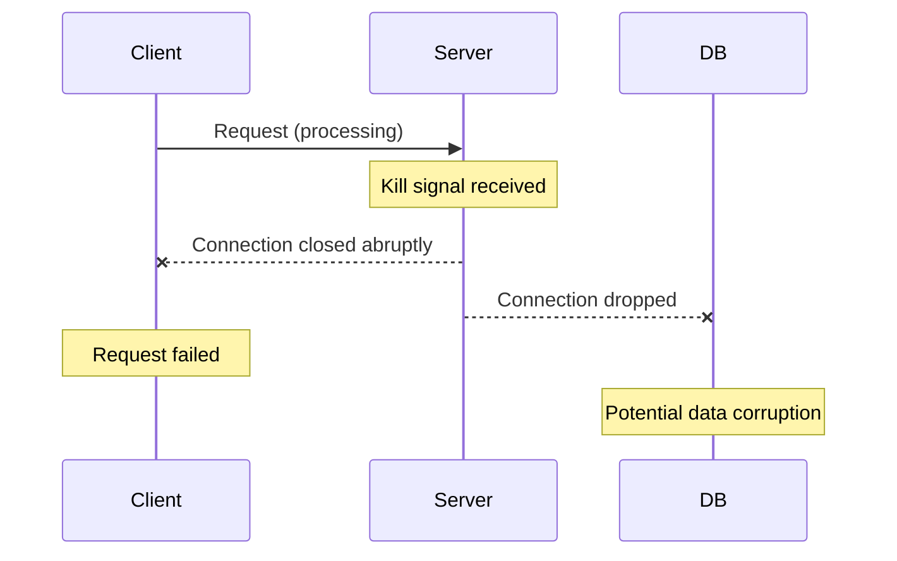
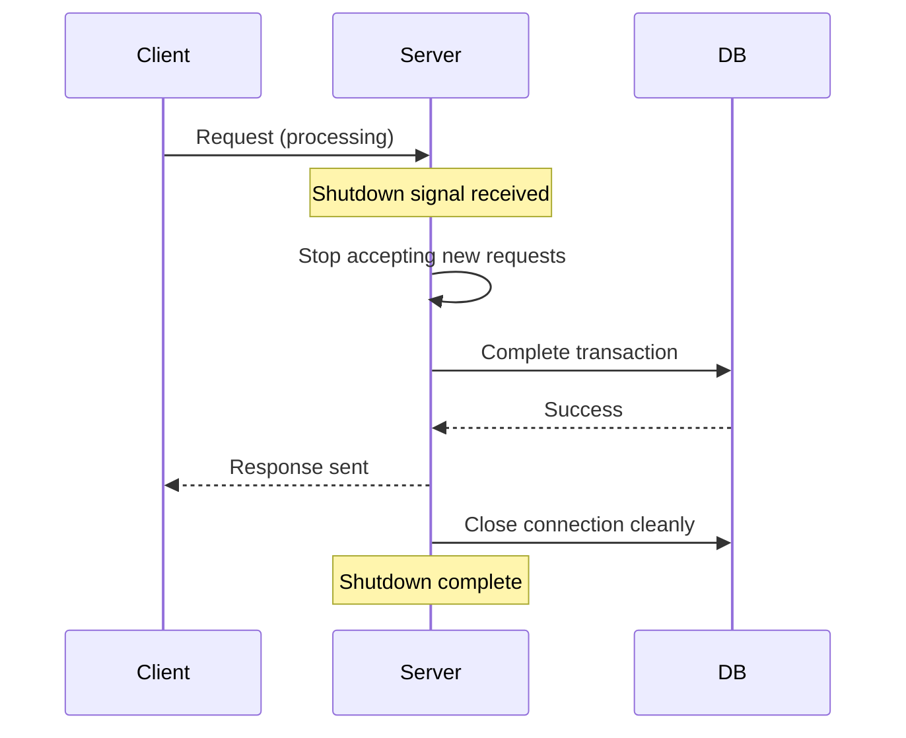

## Overview

Graceful shutdown ensures your server stops cleanly by:
- Finishing existing requests before shutting down
- Rejecting new requests during shutdown
- Closing database connections properly
- Preventing data corruption or lost requests

<Note>
This pattern is essential for production deployments, especially in containerized environments (Docker, Kubernetes) where servers receive shutdown signals.
</Note>

## Why Graceful Shutdown Matters

### Without Graceful Shutdown



Problems:
- Clients receive connection errors
- In-flight database transactions may be incomplete
- Data corruption risks
- Poor user experience

### With Graceful Shutdown



Benefits:
- All in-flight requests complete successfully
- Clean database connection closure
- Zero data loss
- Graceful container restarts

## Basic Implementation

Let's build a simple graceful shutdown from scratch:

```go main.go
package main

import (
    "context"
    "log"
    "net/http"
    "os"
    "os/signal"
    "time"
)

func main() {
    // Create HTTP server
    mux := http.NewServeMux()
    mux.HandleFunc("/", func(w http.ResponseWriter, r *http.Request) {
        time.Sleep(3 * time.Second) // Simulate work
        w.Write([]byte("hello"))
    })
    
    server := &http.Server{
        Addr:    ":8080",
        Handler: mux,
    }
    
    // Start server in goroutine
    go func() {
        log.Println("server started on :8080")
        if err := server.ListenAndServe();
            err != nil && err != http.ErrServerClosed {
            log.Fatal(err)
        }
    }()
    
    // Wait for interrupt signal
    stop := make(chan os.Signal, 1)
    signal.Notify(stop, os.Interrupt)
    
    <-stop // Block until signal received
    
    log.Println("shutting down...")
    
    // Create shutdown context with timeout
    ctx, cancel := context.WithTimeout(context.Background(), 5*time.Second)
    defer cancel()
    
    // Attempt graceful shutdown
    if err := server.Shutdown(ctx); err != nil {
        log.Println("forced shutdown:", err)
    }
    
    log.Println("server exited cleanly")
}
```

## Step-by-Step Breakdown

<Steps>
  <Step title="Create the HTTP Server">
    Define your routes and server configuration:
    
    ```go
    mux := http.NewServeMux()
    mux.HandleFunc("/", handler)
    
    server := &http.Server{
        Addr:    ":8080",
        Handler: mux,
    }
    ```
  </Step>
  
  <Step title="Start Server Non-Blocking">
    Run the server in a goroutine so the main thread can listen for signals:
    
    ```go
    go func() {
        log.Println("server started on :8080")
        if err := server.ListenAndServe();
            err != nil && err != http.ErrServerClosed {
            log.Fatal(err)
        }
    }()
    ```
    
    <Note>
    Check for `http.ErrServerClosed` because `Shutdown()` returns this error when it closes the listener. This is expected behavior, not an actual error.
    </Note>
  </Step>
  
  <Step title="Setup Signal Handler">
    Create a channel to receive OS signals:
    
    ```go
    stop := make(chan os.Signal, 1)
    signal.Notify(stop, os.Interrupt)  // Listen for Ctrl+C
    
    <-stop // Block until signal received
    ```
    
    The buffer size of `1` ensures the signal isn't lost if the channel isn't being read immediately.
  </Step>
  
  <Step title="Create Shutdown Context">
    Set a timeout for the shutdown process:
    
    ```go
    ctx, cancel := context.WithTimeout(context.Background(), 5*time.Second)
    defer cancel()
    ```
    
    This gives in-flight requests 5 seconds to complete before forcing shutdown.
  </Step>
  
  <Step title="Initiate Shutdown">
    Call `Shutdown()` to gracefully stop the server:
    
    ```go
    if err := server.Shutdown(ctx); err != nil {
        log.Println("forced shutdown:", err)
    }
    ```
    
    This:
    - Stops accepting new connections
    - Waits for active requests to complete
    - Returns an error if the context timeout is reached
  </Step>
</Steps>

## Production-Grade Implementation

The `student/` project demonstrates a more robust approach using structured logging:

```go cmd/student/main.go
package main

import (
    "context"
    "errors"
    "log/slog"
    "net/http"
    "os"
    "os/signal"
    "syscall"
    "time"
    
    "github.com/priyanshu-samal/student/internal/config"
)

func main() {
    cfg := config.MustLoad()
    
    // Setup structured logging
    logger := slog.New(slog.NewJSONHandler(os.Stdout, nil))
    slog.SetDefault(logger)
    
    // Create router
    router := http.NewServeMux()
    router.HandleFunc("GET /", func(w http.ResponseWriter, r *http.Request) {
        w.WriteHeader(http.StatusOK)
        _, _ = w.Write([]byte("Welcome"))
    })
    
    // Create server
    server := &http.Server{
        Addr:    cfg.Addr,
        Handler: router,
    }
    
    go startServer(server)
    
    waitForShutdown(server)
}

func startServer(server *http.Server) {
    slog.Info("HTTP server starting", slog.String("addr", server.Addr))
    
    err := server.ListenAndServe()
    if err != nil && !errors.Is(err, http.ErrServerClosed) {
        slog.Error("HTTP server failed", slog.String("error", err.Error()))
        os.Exit(1)
    }
}

func waitForShutdown(server *http.Server) {
    shutdown := make(chan os.Signal, 1)
    signal.Notify(shutdown, syscall.SIGINT, syscall.SIGTERM)
    <-shutdown
    
    slog.Info("Shutdown signal received")
    
    ctx, cancel := context.WithTimeout(context.Background(), 5*time.Second)
    defer cancel()
    
    if err := server.Shutdown(ctx); err != nil {
        slog.Error("Graceful shutdown failed", slog.String("error", err.Error()))
        return
    }
    
    slog.Info("Server shut down cleanly")
}
```

### Enhancements

<Tabs>
  <Tab title="Structured Logging">
    Using `log/slog` provides structured, machine-readable logs:
    
    ```go
    slog.Info("HTTP server starting", 
        slog.String("addr", server.Addr),
        slog.String("env", "production"))
    ```
    
    Output:
    ```json
    {
      "time": "2024-01-15T10:30:00Z",
      "level": "INFO",
      "msg": "HTTP server starting",
      "addr": ":8080",
      "env": "production"
    }
    ```
  </Tab>
  
  <Tab title="Multiple Signals">
    Listen for both `SIGINT` and `SIGTERM`:
    
    ```go
    signal.Notify(shutdown, syscall.SIGINT, syscall.SIGTERM)
    ```
    
    - `SIGINT`: Sent by Ctrl+C (terminal)
    - `SIGTERM`: Sent by `kill` command or container orchestrator
  </Tab>
  
  <Tab title="Error Handling">
    Differentiate between expected and unexpected errors:
    
    ```go
    if err != nil && !errors.Is(err, http.ErrServerClosed) {
        slog.Error("HTTP server failed", slog.String("error", err.Error()))
        os.Exit(1)
    }
    ```
    
    `http.ErrServerClosed` is expected after `Shutdown()`, not an error.
  </Tab>
  
  <Tab title="Configuration">
    Load server configuration from environment or config files:
    
    ```go
    type Config struct {
        Addr string
        Env  string
    }
    
    func MustLoad() *Config {
        addr := os.Getenv("SERVER_ADDR")
        if addr == "" {
            addr = ":8080"
        }
        return &Config{Addr: addr}
    }
    ```
  </Tab>
</Tabs>

## Signal Types

| Signal | Source | Behavior | Use Case |
| :--- | :--- | :--- | :--- |
| `SIGINT` | Ctrl+C in terminal | Request graceful stop | Development |
| `SIGTERM` | `kill <pid>` | Request graceful stop | Production, containers |
| `SIGKILL` | `kill -9 <pid>` | Force immediate stop | Emergency (cannot be caught) |
| `SIGHUP` | Terminal close | Varies by program | Config reload |

<Warning>
**SIGKILL Cannot Be Caught**: `SIGKILL` (`kill -9`) forcibly terminates the process. Always try `SIGTERM` first to allow graceful shutdown.
</Warning>

## Testing Graceful Shutdown

### Test 1: Basic Shutdown

<Steps>
  <Step title="Start Server">
    ```bash
    go run main.go
    ```
  </Step>
  
  <Step title="Send Signal">
    Press `Ctrl+C` in the terminal.
  </Step>
  
  <Step title="Verify Logs">
    You should see:
    ```
    server started on :8080
    shutting down...
    server exited cleanly
    ```
  </Step>
</Steps>

### Test 2: In-Flight Request Handling

<Steps>
  <Step title="Start Server">
    ```bash
    go run main.go
    ```
  </Step>
  
  <Step title="Start Long Request">
    In another terminal:
    ```bash
    curl http://localhost:8080/
    ```
    
    This will take 3 seconds to complete.
  </Step>
  
  <Step title="Send Shutdown Signal">
    While the request is processing, press `Ctrl+C` in the server terminal.
  </Step>
  
  <Step title="Observe Behavior">
    - The curl command completes successfully
    - The server waits for the request to finish
    - Then shuts down cleanly
  </Step>
</Steps>

### Test 3: Timeout Scenario

```go
// Modify handler to take longer than shutdown timeout
mux.HandleFunc("/", func(w http.ResponseWriter, r *http.Request) {
    time.Sleep(10 * time.Second) // Longer than 5s timeout
    w.Write([]byte("hello"))
})
```

Result:
- Server waits 5 seconds (shutdown timeout)
- Forces shutdown, interrupting the request
- Client receives connection error

<Note>
Choose shutdown timeouts based on your longest expected request duration. For most APIs, 5-10 seconds is reasonable.
</Note>

## Advanced Patterns

### Cleanup Tasks on Shutdown

```go
func waitForShutdown(server *http.Server, db *sql.DB) {
    shutdown := make(chan os.Signal, 1)
    signal.Notify(shutdown, syscall.SIGINT, syscall.SIGTERM)
    <-shutdown
    
    slog.Info("Shutdown initiated")
    
    // Shutdown HTTP server
    ctx, cancel := context.WithTimeout(context.Background(), 5*time.Second)
    defer cancel()
    
    if err := server.Shutdown(ctx); err != nil {
        slog.Error("Server shutdown error", slog.String("error", err.Error()))
    }
    
    // Close database connections
    slog.Info("Closing database connections")
    if err := db.Close(); err != nil {
        slog.Error("Database close error", slog.String("error", err.Error()))
    }
    
    slog.Info("Shutdown complete")
}
```

### Multiple Servers

Gracefully shut down multiple servers (HTTP, gRPC, metrics):

```go
func main() {
    httpServer := &http.Server{Addr: ":8080"}
    metricsServer := &http.Server{Addr: ":9090"}
    
    go httpServer.ListenAndServe()
    go metricsServer.ListenAndServe()
    
    shutdown := make(chan os.Signal, 1)
    signal.Notify(shutdown, syscall.SIGINT, syscall.SIGTERM)
    <-shutdown
    
    ctx, cancel := context.WithTimeout(context.Background(), 5*time.Second)
    defer cancel()
    
    // Shutdown both servers
    var wg sync.WaitGroup
    wg.Add(2)
    
    go func() {
        defer wg.Done()
        httpServer.Shutdown(ctx)
    }()
    
    go func() {
        defer wg.Done()
        metricsServer.Shutdown(ctx)
    }()
    
    wg.Wait()
    log.Println("All servers shut down")
}
```

## Docker Integration

Dockerfile that properly handles signals:

```dockerfile
FROM golang:1.21-alpine AS builder
WORKDIR /app
COPY . .
RUN go build -o server cmd/server/main.go

FROM alpine:latest
RUN apk --no-cache add ca-certificates
WORKDIR /root/
COPY --from=builder /app/server .

# Important: use exec form to ensure proper signal handling
CMD ["./server"]
```

<Warning>
**Docker Signal Handling**: Always use the exec form (`CMD ["./server"]`) instead of shell form (`CMD ./server`) to ensure signals reach your Go process.
</Warning>

## Kubernetes Integration

Kubernetes sends `SIGTERM` before killing pods. Configure grace period:

```yaml
apiVersion: v1
kind: Pod
metadata:
  name: go-app
spec:
  terminationGracePeriodSeconds: 30  # Give app 30s to shut down
  containers:
  - name: app
    image: myapp:latest
    lifecycle:
      preStop:
        exec:
          command: ["/bin/sh", "-c", "sleep 5"]  # Wait 5s before SIGTERM
```

## Best Practices

<Steps>
  <Step title="Set Appropriate Timeouts">
    Match shutdown timeout to your longest expected request:
    - Short APIs: 5 seconds
    - File uploads: 30-60 seconds
    - Streaming: 2-5 minutes
  </Step>
  
  <Step title="Handle Multiple Signals">
    Listen for both `SIGINT` (development) and `SIGTERM` (production).
  </Step>
  
  <Step title="Close Resources">
    Clean up:
    - Database connections
    - Message queue connections
    - Open files
    - Background workers
  </Step>
  
  <Step title="Log Everything">
    Use structured logging to track shutdown progress and diagnose issues.
  </Step>
  
  <Step title="Test in Production Environments">
    Test graceful shutdown in staging with production-like traffic patterns.
  </Step>
</Steps>

## Common Pitfalls

<Warning>
**Forgetting Non-Blocking Server Start**: If you don't start the server in a goroutine, your signal handler will never run.

```go
// Wrong: signal handler unreachable
server.ListenAndServe()
signal.Notify(stop, os.Interrupt)

// Correct: signal handler runs
go server.ListenAndServe()
signal.Notify(stop, os.Interrupt)
```
</Warning>

<Warning>
**Ignoring Context Deadline**: If shutdown times out, handle it appropriately:

```go
if err := server.Shutdown(ctx); err != nil {
    if errors.Is(err, context.DeadlineExceeded) {
        log.Println("Forced shutdown after timeout")
    } else {
        log.Println("Shutdown error:", err)
    }
}
```
</Warning>

## Summary

You've learned:
- Why graceful shutdown prevents data loss
- How to implement basic shutdown with `server.Shutdown()`
- Handling OS signals (`SIGINT`, `SIGTERM`)
- Using contexts with timeouts
- Structured logging with `log/slog`
- Production patterns for cleanup and multiple servers
- Docker and Kubernetes integration

## Next Steps

<CardGroup cols={2}>
  <Card title="Authentication" icon="lock" href="/web/authentication">
    See graceful shutdown in the full auth system
  </Card>
  <Card title="REST API" icon="code" href="/web/rest-api">
    Build APIs with proper lifecycle management
  </Card>
</CardGroup>

Graceful shutdown is a production necessity. Master this pattern to build reliable, resilient web services.